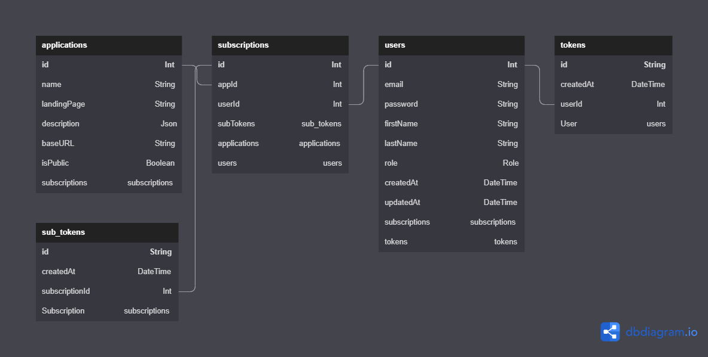
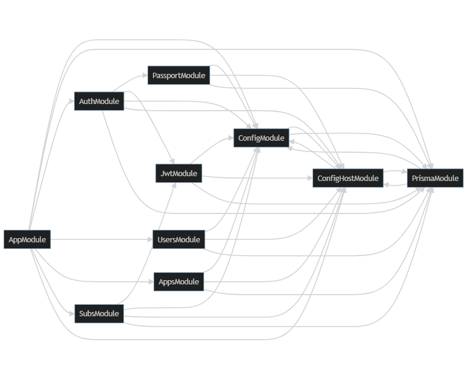

# ms-users-back

<p align="center">
  <a href="https://www.typescriptlang.org/" target="blank"></a>
  <a href="http://nestjs.com/" target="blank"></a>
  <a href="https://www.prisma.io/" target="blank"></a>
</p>

## Description

To manage access to protected url of applications from your amazing company.

## Installation

```bash
npm install
```

## Configuration

Before running the application, you will have to add, at the root level of the project an _.env_ file from the _.env.example_ file.

## Running the app

```bash
# development
npm run start

# watch mode
npm run start:dev

# production mode
npm run start:prod
```

## Test

```bash
# unit tests
npm run test

# e2e tests
npm run test:e2e

# test coverage
npm run test:cov
```

## API documentation

While the application is running, you can see the documentation about the endpoint at the following web page : [Swagger documentation](http://localhost:3000/api).

## Database



You can see the associated commands at the _prisma\dbml\schema.dbml_ file.

### Seeding the data

After filling the _.env_ file you can fill your database with some mock users and applications (defined in _mock/_ folder). Then to populate this data into your database, you will have to run the following commands : `npx prisma db seed`.

### Editing the data itself

If you want to update the database, you can do it by running `npx prisma db studio`, and then access to the following web page : [Prisma Studio](http://localhost:5555/).

### Editing the data model

If you update the database (by editing the _prisma/schema.prisma_ file) you have to update the associated compiled files by running `npx prisma generate` and then you may need to update the database with `npx prisma db push`.

## Architecture of the code

| Folder                   | Purpose                                                                                                             |
| ------------------------ | ------------------------------------------------------------------------------------------------------------------- |
| `app.controller.ts`      | A basic controller with a single route.                                                                             |
| `app.controller.spec.ts` | The unit tests for the controller.                                                                                  |
| `app.module.ts`          | The root module of the application.                                                                                 |
| `app.service.ts`         | A basic service with a single method.                                                                               |
| `main.ts`                | The entry file of the application which uses the core function `NestFactory` to create a Nest application instance. |

For nestJS project, in general :

- **Modules:** used to organize the code and split features into logical reusable units. Grouped TypeScript files are decorated with “@Module” decorator which provides metadata that NestJs makes use of to organize the application structure.
- **Providers:** also called services, which are designed to abstract any form of complexity and logic. Providers can be created and injected into controllers or other providers.
- **Controllers:** responsible for handling incoming requests and returning appropriate responses to the client-side of the application (for example call to the API).

### Dependency Graph



To update the above graph, run the following command : `npm run doc:graph`.

### DTO vs Entities

- "Entities" : refer to units of composition of the overall system data. They normally represent business objects like: bank accounts, employees, products, etc. They can be used to persist the state of the system to a database. => _prisma.io_
- "Data transfer objects" : are ephemeral collections of data transferred for a very specific purpose. For example, to display a list of products of a specific kind to an end user. You do not want to send all of the data that represents every product entity to the user, but only what is needed for this purpose. => _example.dto.ts_

[Reference](https://stackoverflow.com/a/65415693)

## Dockerization

- `Dockerfile` - This file will be responsible for importing the Docker images, dividing them into development and production environments, copying all of our files, and installing dependencies.
- `docker-compose.yml` - This file will be responsible for defining our containers, required images for the app other services, storage volumes, environment variables, etc.

### To launch our application in containers

Run the following commands at the root directory :

```bash
docker compose build
docker compose up
```

## References

- NestJS :
  - [authentication](https://docs.nestjs.com/security/authentication)
  - [authorization](https://docs.nestjs.com/security/authorization)
  - [configuration](https://docs.nestjs.com/techniques/configuration)
  - [prisma-client-in-your-nestjs-services](https://docs.nestjs.com/recipes/prisma#use-prisma-client-in-your-nestjs-services)
  - CLI :
    - [Introducing CLI Resource Generators](https://trilon.io/blog/introducing-cli-generators-crud-api-in-1-minute#Introduction-to-CLI-Generators)
  - practical :
    - [Building a REST API with NestJS and Prisma](https://www.notion.so/marcjulian/Building-a-REST-API-with-NestJS-and-Prisma-8296846a0fc54ac0b445ae9364805669)
    - [nestjs-prisma-workshop](https://github.com/marcjulian/nestjs-prisma-workshop)
- Token :
  - [JWT](https://jwt.io/)
  - [Learning JWT](https://github.com/dwyl/learn-json-web-tokens)
  - [Credentials in JWT](https://stackoverflow.com/questions/42652695/is-it-ok-to-store-user-credentials-in-the-jwt/42652851#42652851)
- Database :
  - [Prisma schema reference - Naming Convention](https://www.prisma.io/docs/reference/api-reference/prisma-schema-reference#naming-conventions)
  - [SQL Style Guide](https://www.sqlstyle.guide)
  - [Table Definition](https://www.dbml.org/docs/#table-definition)
  - [dbDiagram Docs](https://dbdiagram.io/docs/)
- Docker
  - [Containers vs. virtual machines | Atlassian](https://www.atlassian.com/en/continuous-delivery/microservices/containers)
  - [Best practices for writing Docker files](https://docs.docker.com/develop/develop-images/dockerfile_best-practices/)
  - [Docker Nodejs Tutorial](https://docs.docker.com/language/nodejs/)
  - [Example](https://github.com/notiz-dev/nestjs-prisma/blob/main/schematics/nestjs-prisma/templates/docker/common/Dockerfile)
